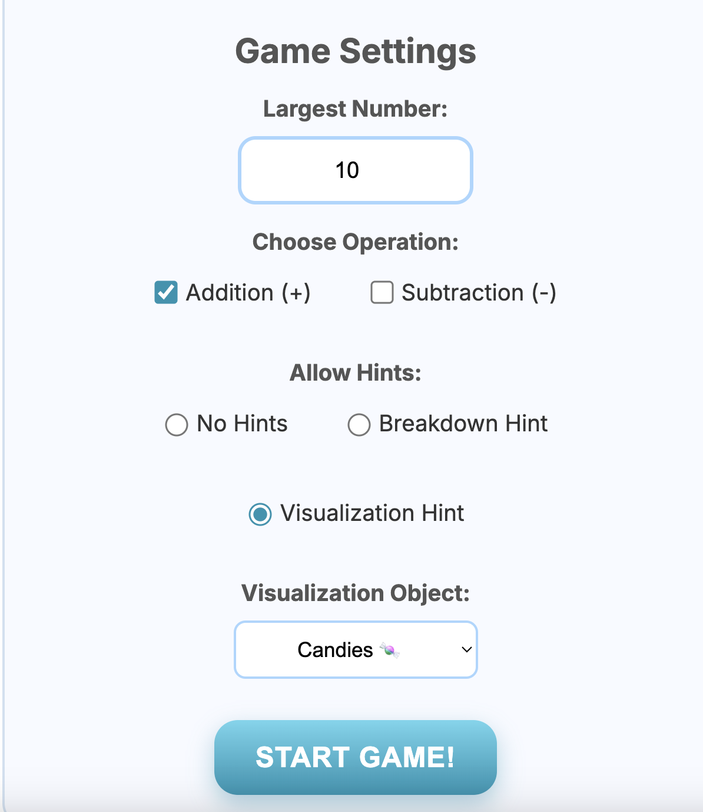
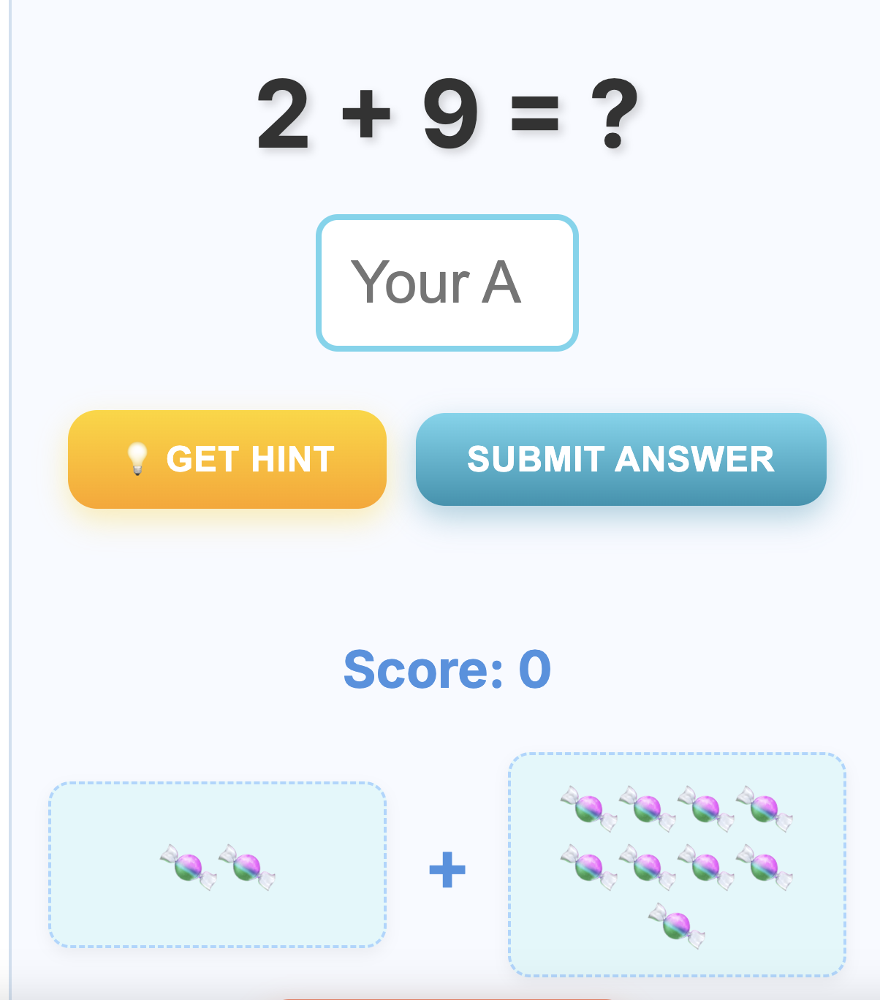

# 📘 Math Game for First Graders – Instructions

Welcome! This is a fun and interactive **Math Game** designed especially for first graders. It runs right in your web browser—no need to install anything or write code.

---

## ✅ What You Need

- A **computer or laptop**
- Any modern **web browser** (Chrome, Edge, Firefox, Safari)
- The game files (usually a `.html` file, and possibly some folders like `images` or `scripts`)

---

## 📂 What’s in the Folder?

- `index.html` – This is the main file. It opens the game.
- *(Optional)* `style.css`, `script.js`, or folders like `images/` – These support how the game looks and works. Don’t delete or move them.

---

## ▶️ How to Play the Game

1. **Download or unzip the folder** containing the game files (if it’s in a ZIP file).
2. **Double-click on `index.html`.**
   - It should automatically open in your web browser.
   - You’ll see the game start screen.
  

> 💡 If double-clicking doesn’t work, right-click on `index.html` and choose  
> **"Open with" → "Google Chrome"** or another browser.

3. **Start playing!**
   - Follow the instructions on screen.
   - The game will ask fun math questions (like addition or subtraction), and give feedback with emojis or sounds.

---

## 🔄 Troubleshooting

- If the game doesn't load correctly, make sure:
  - You didn’t move or rename any files in the folder.
  - You’re using a modern browser (Chrome is recommended).
  - All files are in the **same folder**.

---

## 🙋 Need Help?

Ask someone familiar with computers to help if:
- Nothing happens when you open `index.html`
- The graphics or buttons are missing
- You accidentally deleted part of the folder

---

## 👩‍🏫 Teachers: Tips for the Classroom

- You can copy the game folder to student computers or a shared drive.
- The game runs **offline** — no internet needed after setup.
- Pair students for collaborative learning or let them take turns.
